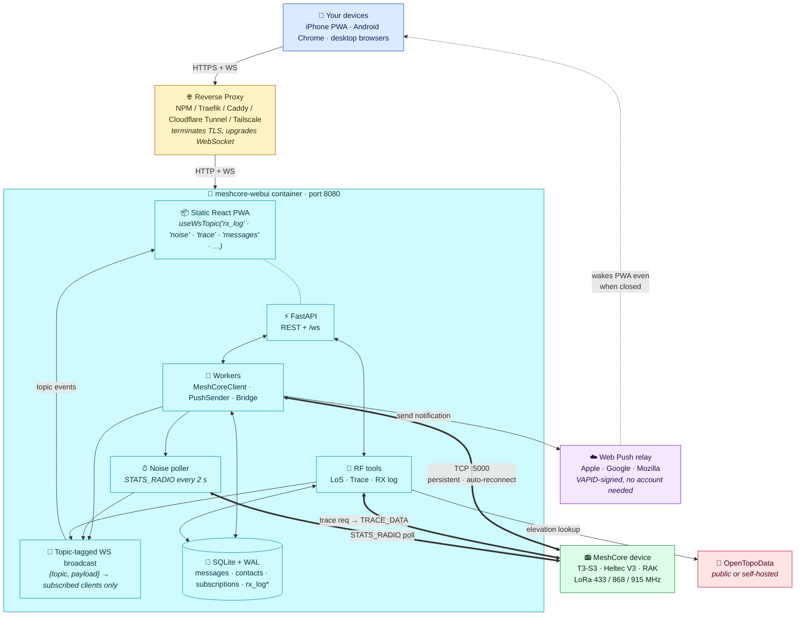
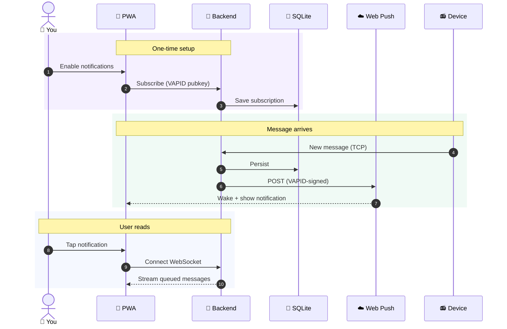
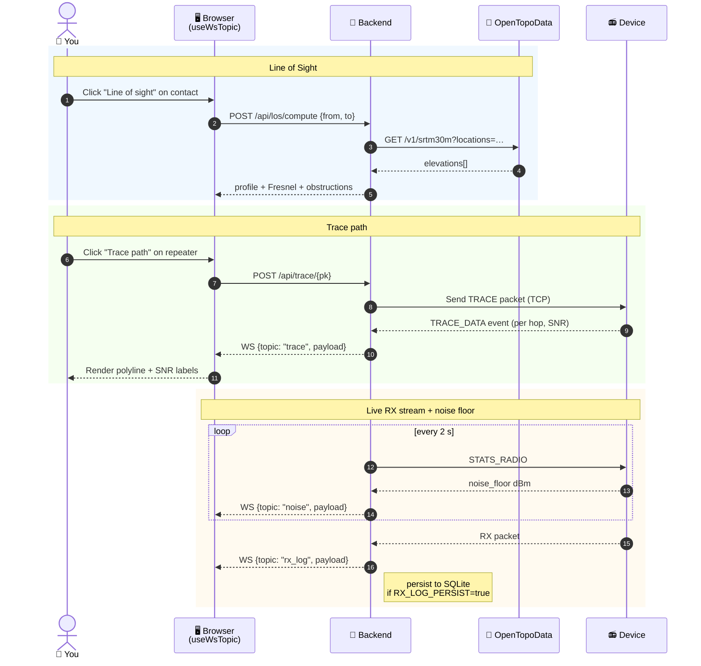

<div align="center">
  

# MeshCore WebUI

**Self-hostable web client for [MeshCore](https://meshcore.dev) LoRa mesh radio devices, with first-class iOS PWA push notifications.**

</div>

---

## What is this?

A single Docker container that turns any MeshCore-compatible companion radio (LilyGo T3-S3, Heltec V3, RAK boards, etc.) into a polished web messenger you can use from any browser — including iOS Safari with push notifications that work when the app is closed.

It bridges the gaps the official mobile app can't:

| Capability | Official mobile app | meshcore-webui |
|---|---|---|
| Works over WiFi/TCP (not BLE) | ✅ | ✅ |
| Push notifications when app is closed | ❌ iOS (TCP socket dies) | ✅ via Web Push + VAPID |
| Browser-only access (any device with HTTPS) | ❌ | ✅ |
| Stationary always-on bridge | ❌ | ✅ (Docker on Synology/Pi/etc.) |
| Multi-device sync via shared backend | ❌ | ✅ (one backend, many browsers) |
| Self-hostable, no third-party servers | ❌ | ✅ |

## Features

- 💬 **Direct messages + channel chat** — with status, ACK, optimistic UI, message grouping
- 👥 **Contacts** — virtualized list of 350+ peers, color-hashed avatars, search filter
- 🗺️ **Map view** — Leaflet with dark mode, your device pulses as a distinct "ME" marker, contact clusters
- 🔔 **Push notifications** — iOS 16.4+ PWA / Android / desktop browsers via Web Push (no Apple Developer account needed)
- 📡 **Contact actions** — telemetry, ping, share, ACL, path discovery, star/favourite
- 🎨 **Polished UI** — shadcn/ui, dark/light mode, mobile-first, conversation grouping, @-mentions
- 🔒 **Optional API key** auth for defense-in-depth behind your reverse proxy
- 📦 **Single image** — `~435 MB`, healthcheck, runs anywhere

### Image attachment sharing

Tap the `+` button in any chat and pick **Image** to upload a photo. The image is re-encoded (EXIF stripped, downsized to 2560 px on the long edge, served as WebP) and stored locally under `/data/attachments/`. The server returns a short public URL like `https://mesh.example.com/s/aB3kZ9pX` and stages it in your message input so you can add a caption before sending it over LoRa. Recipients open the link from any browser — no API key, no app install. Manage and purge attachments from **Settings → Attachments**.

**Required config:** set `PUBLIC_BASE_URL` to your externally-reachable HTTPS base URL in the container's environment block. Without it, uploads fail with a clear error. The `/s/` (viewer page) and `/i/` (raw image) paths must be reachable from wherever your recipients open links — behind a reverse proxy, expose them alongside the rest of the app.

**Built-in defenses:** 8-char base62 unguessable slugs (~2.18 × 10¹⁴ space) plus per-IP rate limit (100/min, 1000/hour) on the public endpoints; EXIF stripping (incl. GPS); Pillow re-serialization defeats polyglot files; explicit `image/webp` `Content-Type` + `nosniff`; tight CSP on the viewer page.

### RF tools

- 📶 **Line of Sight calculator** (`/map` → click any node's "Line of sight" button) — terrain profile + Fresnel zone analysis between your device and any contact. Uses [OpenTopoData](https://www.opentopodata.org/) (public or self-hosted) for elevation.
- 🧭 **Trace path / Ping** (`/map` → click a repeater's "Trace path" button, or the chat header's "Ping") — directed trace to a specific peer. Mirrors the first-party [`meshcore-cli`](https://github.com/meshcore-dev/meshcore-cli)'s `trace` / `dtrace` flow: builds a symmetric out-and-back path through the contact's stored hops (or zero-hop direct probe when no path is stored) and waits the firmware-suggested timeout. Reachable peers return in ~1 s with round-trip duration, outbound SNR, and return-leg SNR — same surface as the official mobile app's "Ping".
- 📜 **RX log** (`/rx-log`) — realtime stream of every packet your device receives, with filter, search, and CSV/JSON export. Optional SQLite persistence.
- 📉 **Noise floor chart** (`/noise` or as a widget on `/device`) — realtime sliding chart of the radio noise floor, polled every 2 s.
- 📈 **Continuous trace monitor** (contact detail page, under the Link diagnostic) — pick an interval (5–300 s) and tap **Start**; the device fires a directed trace every tick and the chart plots SNR-there / SNR-back over time, with an optional per-hop overlay. Failed traces show as gaps so dropped links are visible at a glance. Intended for antenna positioning: rotate or relocate, watch the line move. One session runs at a time per device — **Take over** replaces an existing session if you want to switch contacts mid-run. Wipe per-contact history from the same card, or sweep the whole table from the admin DangerZone ("Trace monitor history"). Persistence lives in the `trace_samples` table; samples broadcast live over the `/ws` topic `trace_monitor`.

## Architecture



### Why this shape?

- **Backend holds the TCP socket** — iOS suspends apps in seconds; browsers can't open raw TCP. A persistent container on your LAN sidesteps both.
- **Web Push beats native push for self-hosters** — no Apple Developer Program, no APNs cert, no Firebase project. VAPID signs the payload; the user's browser picks its own push service.
- **Reverse proxy is yours** — we don't bundle TLS. Pick what your homelab already runs.

### Push notification flow



### RF tools flow



---

## Quickstart

You need: Docker + Docker Compose, a MeshCore device reachable from the container by IP, and ideally a domain pointing at your homelab (HTTPS is required for push notifications on iOS).

### 1. Clone

```bash
git clone https://github.com/<you>/meshcore-webui.git
cd meshcore-webui
mkdir -p data secrets
```

### 2. Generate a VAPID keypair (one time, keep private key safe)

If you have `uv` installed locally:

```bash
cd backend && uv run python scripts/gen_vapid.py ../secrets && cd ..
```

Otherwise via Docker (no host Python needed):

```bash
docker run --rm -v "$(pwd)/secrets:/out" python:3.12-slim sh -c \
  "pip install -q cryptography && python -c '
from cryptography.hazmat.primitives.asymmetric import ec
from cryptography.hazmat.primitives import serialization
from base64 import urlsafe_b64encode
k = ec.generate_private_key(ec.SECP256R1())
open(\"/out/vapid_private.pem\",\"wb\").write(k.private_bytes(
  serialization.Encoding.PEM, serialization.PrivateFormat.PKCS8,
  serialization.NoEncryption()))
pub = k.public_key().public_bytes(
  serialization.Encoding.X962, serialization.PublicFormat.UncompressedPoint)
open(\"/out/vapid_public.txt\",\"w\").write(urlsafe_b64encode(pub).rstrip(b\"=\").decode())
print(\"OK\")'"
```

Files produced: `secrets/vapid_private.pem` (mounted into container) and `secrets/vapid_public.txt` (used at build time so the frontend can subscribe with the matching key).

### 3. Build the image

```bash
VITE_VAPID_PUBLIC_KEY=$(cat secrets/vapid_public.txt) \
  docker build -t meshcore-webui:dev \
  --build-arg VITE_VAPID_PUBLIC_KEY="$VITE_VAPID_PUBLIC_KEY" .
```

### 4. Configure + run

```bash
cp docker-compose.example.yml docker-compose.yml
# Edit MESHCORE_HOST to your device's IP, VAPID_SUBJECT to your email
docker compose up -d
docker compose logs -f
```

Open `http://<host>:8090` (or whichever port you mapped). You should see your contact list within a few seconds.

---

## Configuration

All settings are environment variables on the container:

| Variable | Default | Purpose |
|---|---|---|
| `MESHCORE_HOST` | `192.168.4.1` | IP of your MeshCore companion radio (must speak TCP companion protocol) |
| `MESHCORE_PORT` | `5000` | TCP port of the companion server (firmware default) |
| `VAPID_PRIVATE_KEY_PATH` | `/run/secrets/vapid_private.pem` | Where the container looks for the VAPID private PEM (mount your secret here) |
| `VAPID_SUBJECT` | `mailto:admin@example.com` | Required by Web Push protocol; some push services log it |
| `MESHCORE_WEBUI_API_KEY` | _(unset)_ | If set, requires `Authorization: Bearer <key>` on all `/api/*` + `/ws` requests |
| `DATABASE_URL` | `sqlite+aiosqlite:////data/meshcore.db` | Override if you want the DB on a different mount |
| `STATIC_DIR` | `/app/static` | Where the built frontend lives in the image (don't change normally) |
| `MESHCORE_WEBUI_ELEVATION_BASE_URL` | `https://api.opentopodata.org/v1` | Elevation API for Line of Sight. Point at a self-hosted [OpenTopoData](https://www.opentopodata.org/) instance to avoid public rate limits |
| `MESHCORE_WEBUI_ELEVATION_DATASET` | `srtm30m` | OpenTopoData dataset name (e.g. `srtm30m`, `aster30m`, `eudem25m`) |
| `MESHCORE_WEBUI_RX_LOG_PERSIST` | `false` | Set `true` to persist every RX event to SQLite (in addition to the in-memory buffer) |
| `MESHCORE_WEBUI_RX_LOG_BUFFER_SIZE` | `1000` | In-memory ring buffer size for the `/rx-log` page |
| `MESHCORE_WEBUI_NOISE_POLL_INTERVAL_S` | `2.0` | Noise floor polling interval in seconds (`STATS_RADIO` cadence) |

Example `docker-compose.yml`:

```yaml
services:
  meshcore-webui:
    image: meshcore-webui:dev
    restart: unless-stopped
    ports:
      - "8090:8080"
    environment:
      MESHCORE_HOST: 192.168.4.1   # your MeshCore device LAN IP
      MESHCORE_PORT: "5000"
      VAPID_SUBJECT: "mailto:you@example.com"
      # MESHCORE_WEBUI_API_KEY: "long-random-string"
    volumes:
      - ./data:/data
      - ./secrets/vapid_private.pem:/run/secrets/vapid_private.pem:ro
```

---

## LAN access (no proxy)

The Docker container binds `0.0.0.0:8090` by default via `docker-compose.yml`'s `ports: "8090:8080"` mapping — meaning any device on your LAN can reach it once the host's firewall permits port 8090.

```bash
# 1. Find your host's LAN IP
ipconfig getifaddr en0       # macOS
hostname -I | awk '{print $1}'  # Linux

# 2. From another device on the same LAN:
#    open http://<host-lan-ip>:8090
```

**Caveats on iPhone/iPad:**
- Plain `http://` is fine for the chat UI but the **PWA install** and **Web Push** features require HTTPS even on LAN. Use the reverse proxy section below to terminate TLS (Tailscale Funnel + a free `*.ts.net` cert is the lowest-friction option).
- If macOS is the host and the connection times out, enable LAN access for Docker Desktop in System Settings → Network → Firewall, OR run `sudo pfctl -d` briefly while testing to confirm it's the firewall.

---

## Reverse proxy + HTTPS

The container speaks plain HTTP on port 8080. **You** terminate TLS at your reverse proxy and forward WebSocket upgrades through. iOS push notifications require a valid HTTPS cert — `http://` and self-signed origins will silently fail to register.

Any reverse proxy works as long as it forwards WebSocket upgrades. Tested with:

- **Nginx Proxy Manager** (easiest if you're new) — Forward Hostname `<your-host>`, Forward Port `8090`, ✅ **Websockets Support**, ✅ Force SSL, Let's Encrypt
- **Traefik** — standard Docker labels with `traefik.http.services.meshcore-webui.loadbalancer.server.port=8080`
- **Caddy** — one-liner `meshcore.example.com { reverse_proxy meshcore-webui:8080 }`
- **Cloudflare Tunnel** — no port forwarding, free TLS, automatic WS support
- **Tailscale Funnel** — zero-config TLS via Tailscale, instant `*.ts.net` cert

---

## Radio control

The **Device** page exposes the full MeshCore radio + behaviour config:

- **Overview** — device info, GPS position editor, send-advert actions
- **Radio** — region preset picker (EU 868, US 915, AU 915, KR 920, IN 866, HK 920, 433 ISM, Custom) with a live Geist-Mono readout (frequency, bandwidth, spreading factor, coding rate, computed airtime/data-rate/sensitivity), TX-power slider clamped to the firmware's hardware ceiling, RX tuning (rx_delay, airtime_factor)
- **Behaviour** — device name, telemetry sub-modes (base/loc/env), advert + ack policy, BLE pairing PIN, custom vars, device time sync

Changing radio frequency / BW / SF / CR detunes this node from every other node still on the previous preset. The Apply path requires you to type `APPLY` and waits up to 15 s for the supervisor to re-establish the companion link after the modem re-initialises. TX power, tuning, and behaviour edits don't require a confirm — they're reversible and don't detach the radio from the mesh.

Implementation plan: [`docs/plans/2026-05-22-device-control-surface.md`](docs/plans/2026-05-22-device-control-surface.md).

---

## iOS push setup

iOS supports Web Push **only for PWAs installed to the Home Screen** (iOS 16.4+).

1. Open `https://your-meshcore-domain` in **Safari** (not Chrome on iOS — same WebKit engine, but Chrome can't register service workers from a home-screen install)
2. Tap the **Share** button → **Add to Home Screen**
3. Launch the app from the new home-screen icon (not the Safari tab)
4. Go to **Settings** inside the app → toggle **Push notifications** on
5. Accept the iOS permission prompt when it appears

Notifications now arrive with the mesh-network icon even when the app is closed.

> **Troubleshooting:** if the push toggle does nothing, you're probably on `http://` or your reverse proxy isn't issuing a valid cert. Check Safari's URL bar for a padlock. iOS 17.4 EU users were briefly affected by a DMA-related regression — fully fixed by iOS 18.

---

## API key auth (optional)

By default the container is open on whatever interface you bind. For added defense-in-depth (especially if your reverse proxy auth is misconfigured), set:

```yaml
environment:
  MESHCORE_WEBUI_API_KEY: "long-random-string-here"
```

Then send `Authorization: Bearer <key>` on every request. The frontend Settings page has a field that stores the key in `localStorage` and attaches it automatically.

`/api/health` is always open so reverse proxies can health-check it without the key.

For real user-facing auth (SSO, login pages, etc.), put **Authelia** or **Cloudflare Access** in front of the container. Cookie-based auth survives iOS Add-to-Home-Screen cleanly; HTTP Basic does not.

### Public-internet hardening checklist

If you're exposing this service beyond a trusted LAN, walk through this list:

1. **Set `MESHCORE_WEBUI_API_KEY` to a strong random secret.** Generate with `openssl rand -hex 32`. An empty value is rejected at startup — leave the variable absent for open-access mode, never set it to an empty string.
2. **Strip WebSocket `?token=…` query strings from your reverse-proxy access logs.** Browsers can't attach `Authorization` headers to `new WebSocket()` so the SPA sends the key in the URL. Caddy logs the upgrade URL by default, which preserves the token in plaintext.

   Caddy snippet:
   ```caddy
   meshcore.example.com {
     reverse_proxy meshcore-webui:8080
     log {
       output file /var/log/caddy/access.log
       format json {
         # Drop the query string from logged URIs so ?token=… is never written.
         message_key uri
       }
     }
   }
   ```
   Nginx: `log_format` without `$query_string`, or `set $loggable_uri $uri;` then log `$loggable_uri`.

3. **The app already sets** `X-Frame-Options: DENY`, `X-Content-Type-Options: nosniff`, and `Referrer-Policy: strict-origin-when-cross-origin` on every response. If your proxy strips them, add them back at the proxy layer.

4. **Every authenticated request is audited** at `app.audit` INFO level. The bearer token is replaced with an 8-char SHA-256 fingerprint — the raw value never lands in `docker logs`. Grep `app.audit` for `status=401` to spot brute-force attempts; grep `key=` to delineate sessions across key rotations.

5. **Factory reset (`POST /api/device/reset`) destroys the radio's identity keypair.** It is gated behind a typed-confirm token AND the API key. If you don't need it from the public origin, block the route at the proxy.

---

## Development

### Backend

```bash
cd backend
uv venv --python 3.12
uv pip install -e ".[dev]"
uv run pytest -q                              # ~107 tests
uv run uvicorn app.main:app --reload --port 8765
```

Requires Python 3.12 + [uv](https://github.com/astral-sh/uv) ≥ 0.5.

### Frontend

```bash
cd frontend
pnpm install
pnpm test --run                               # vitest, ~42 tests
pnpm dev                                      # vite at http://localhost:5173
pnpm build
```

Requires Node 22 + pnpm ≥ 9. The dev server proxies `/api` and `/ws` to `http://localhost:8765`.

`VITE_VAPID_PUBLIC_KEY` must be set at build time (read from `secrets/vapid_public.txt`).

### Regenerating the icon set

The mesh-network icon is generated from `frontend/public/icons/source*.svg`:

```bash
cd frontend
uv run --with cairosvg --with pillow python scripts/build-icons.py
```

Edit the SVGs first, then rerun to regenerate all PNG sizes + the root `favicon.svg`.

---

## Project layout

```
.
├── backend/                   # FastAPI + SQLAlchemy + meshcore + pywebpush
│   ├── app/
│   │   ├── api/              # REST routers + /ws
│   │   ├── core/             # Settings, VAPID loader
│   │   ├── db/               # async session, declarative models
│   │   ├── middleware/       # API key bearer
│   │   ├── services/         # MeshCoreClient, PushSender, MeshCoreBridge, TaskPool, read state
│   │   └── schemas/          # Pydantic v2 input/output
│   ├── alembic/              # async migrations
│   ├── scripts/gen_vapid.py
│   └── tests/                # pytest + httpx
├── frontend/                  # Vite + React 18 + TS + Tailwind v4 + shadcn/ui
│   ├── src/
│   │   ├── components/       # layout, theme, map, contact-avatar
│   │   ├── features/         # chat, contacts, channels, device — domain modules
│   │   ├── pages/            # routed top-level pages
│   │   ├── pwa/              # SW register, install prompt, push subscribe
│   │   ├── realtime/         # useWebSocket, WebSocketProvider, Zod schema
│   │   ├── lib/              # api wrapper, leaflet helpers, geo, avatar
│   │   └── sw/sw.ts          # service worker (push handler + cache strategy)
│   ├── public/icons/         # source.svg + generated PNG sizes
│   └── scripts/build-icons.py
├── Dockerfile                # multi-stage: node-builder → python-runtime
├── docker-compose.example.yml
└── .github/workflows/        # CI: backend tests + frontend build + GHCR push
```

---

## Status

Working with real hardware: tested against a LilyGo T3-S3 V1 running MeshCore companion firmware over TCP. 240+ backend / 137+ frontend tests passing.

---

## License

MIT — see [LICENSE](LICENSE).

Built on top of:
[MeshCore](https://meshcore.dev) ·
[meshcore_py](https://github.com/meshcore-dev/meshcore_py) ·
[FastAPI](https://fastapi.tiangolo.com) ·
[shadcn/ui](https://ui.shadcn.com) ·
[Leaflet](https://leafletjs.com) ·
[pywebpush](https://github.com/web-push-libs/pywebpush)
