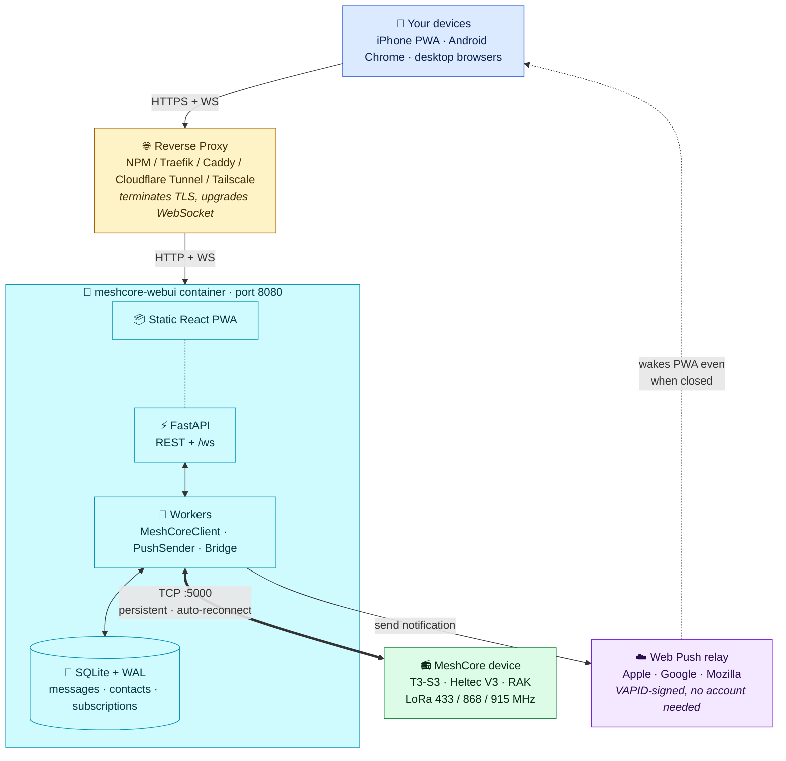
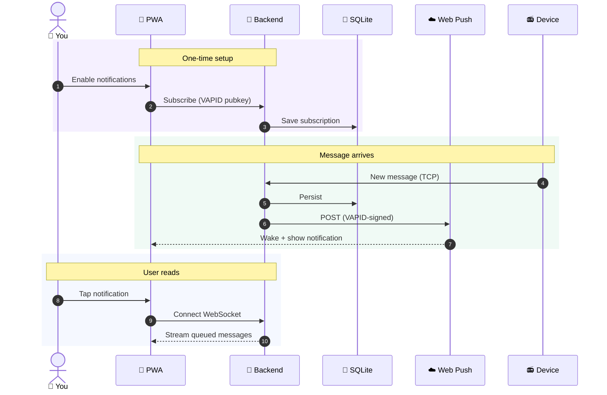

<div align="center">
  

# MeshCore WebUI

**Self-hostable web client for [MeshCore](https://meshcore.dev) LoRa mesh radio devices, with first-class iOS PWA push notifications.**

</div>

---

## What is this?

A single Docker container that turns any MeshCore-compatible companion radio (LilyGo T3-S3, Heltec V3, RAK boards, etc.) into a polished web messenger you can use from any browser — including iOS Safari with push notifications that work when the app is closed.

It bridges the gaps the official mobile app can't:

| Capability | Official mobile app | meshcore-webui |
|---|---|---|
| Works over WiFi/TCP (not BLE) | ✅ | ✅ |
| Push notifications when app is closed | ❌ iOS (TCP socket dies) | ✅ via Web Push + VAPID |
| Browser-only access (any device with HTTPS) | ❌ | ✅ |
| Stationary always-on bridge | ❌ | ✅ (Docker on Synology/Pi/etc.) |
| Multi-device sync via shared backend | ❌ | ✅ (one backend, many browsers) |
| Self-hostable, no third-party servers | ❌ | ✅ |

## Features

- 💬 **Direct messages + channel chat** — with status, ACK, optimistic UI, message grouping
- 👥 **Contacts** — virtualized list of 350+ peers, color-hashed avatars, search filter
- 🗺️ **Map view** — Leaflet with dark mode, your device pulses as a distinct "ME" marker, contact clusters
- 🔔 **Push notifications** — iOS 16.4+ PWA / Android / desktop browsers via Web Push (no Apple Developer account needed)
- 📡 **Contact actions** — telemetry, ping, share, ACL, path discovery, star/favourite
- 🎨 **Polished UI** — shadcn/ui, dark/light mode, mobile-first, conversation grouping, @-mentions
- 🔒 **Optional API key** auth for defense-in-depth behind your reverse proxy
- 📦 **Single image** — `~435 MB`, healthcheck, runs anywhere

## Architecture



### Why this shape?

- **Backend holds the TCP socket** — iOS suspends apps in seconds; browsers can't open raw TCP. A persistent container on your LAN sidesteps both.
- **Web Push beats native push for self-hosters** — no Apple Developer Program, no APNs cert, no Firebase project. VAPID signs the payload; the user's browser picks its own push service.
- **Reverse proxy is yours** — we don't bundle TLS. Pick what your homelab already runs.

### Push notification flow



---

## Quickstart

You need: Docker + Docker Compose, a MeshCore device reachable from the container by IP, and ideally a domain pointing at your homelab (HTTPS is required for push notifications on iOS).

### 1. Clone

```bash
git clone https://github.com/<you>/meshcore-webui.git
cd meshcore-webui
mkdir -p data secrets
```

### 2. Generate a VAPID keypair (one time, keep private key safe)

If you have `uv` installed locally:

```bash
cd backend && uv run python scripts/gen_vapid.py ../secrets && cd ..
```

Otherwise via Docker (no host Python needed):

```bash
docker run --rm -v "$(pwd)/secrets:/out" python:3.12-slim sh -c \
  "pip install -q cryptography && python -c '
from cryptography.hazmat.primitives.asymmetric import ec
from cryptography.hazmat.primitives import serialization
from base64 import urlsafe_b64encode
k = ec.generate_private_key(ec.SECP256R1())
open(\"/out/vapid_private.pem\",\"wb\").write(k.private_bytes(
  serialization.Encoding.PEM, serialization.PrivateFormat.PKCS8,
  serialization.NoEncryption()))
pub = k.public_key().public_bytes(
  serialization.Encoding.X962, serialization.PublicFormat.UncompressedPoint)
open(\"/out/vapid_public.txt\",\"w\").write(urlsafe_b64encode(pub).rstrip(b\"=\").decode())
print(\"OK\")'"
```

Files produced: `secrets/vapid_private.pem` (mounted into container) and `secrets/vapid_public.txt` (used at build time so the frontend can subscribe with the matching key).

### 3. Build the image

```bash
VITE_VAPID_PUBLIC_KEY=$(cat secrets/vapid_public.txt) \
  docker build -t meshcore-webui:dev \
  --build-arg VITE_VAPID_PUBLIC_KEY="$VITE_VAPID_PUBLIC_KEY" .
```

### 4. Configure + run

```bash
cp docker-compose.example.yml docker-compose.yml
# Edit MESHCORE_HOST to your device's IP, VAPID_SUBJECT to your email
docker compose up -d
docker compose logs -f
```

Open `http://<host>:8090` (or whichever port you mapped). You should see your contact list within a few seconds.

---

## Configuration

All settings are environment variables on the container:

| Variable | Default | Purpose |
|---|---|---|
| `MESHCORE_HOST` | `192.168.4.1` | IP of your MeshCore companion radio (must speak TCP companion protocol) |
| `MESHCORE_PORT` | `5000` | TCP port of the companion server (firmware default) |
| `VAPID_PRIVATE_KEY_PATH` | `/run/secrets/vapid_private.pem` | Where the container looks for the VAPID private PEM (mount your secret here) |
| `VAPID_SUBJECT` | `mailto:admin@example.com` | Required by Web Push protocol; some push services log it |
| `MESHCORE_WEBUI_API_KEY` | _(unset)_ | If set, requires `Authorization: Bearer <key>` on all `/api/*` + `/ws` requests |
| `DATABASE_URL` | `sqlite+aiosqlite:////data/meshcore.db` | Override if you want the DB on a different mount |
| `STATIC_DIR` | `/app/static` | Where the built frontend lives in the image (don't change normally) |

Example `docker-compose.yml`:

```yaml
services:
  meshcore-webui:
    image: meshcore-webui:dev
    restart: unless-stopped
    ports:
      - "8090:8080"
    environment:
      MESHCORE_HOST: 192.168.88.223
      MESHCORE_PORT: "5000"
      VAPID_SUBJECT: "mailto:you@example.com"
      # MESHCORE_WEBUI_API_KEY: "long-random-string"
    volumes:
      - ./data:/data
      - ./secrets/vapid_private.pem:/run/secrets/vapid_private.pem:ro
```

---

## Reverse proxy + HTTPS

The container speaks plain HTTP on port 8080. **You** terminate TLS at your reverse proxy and forward WebSocket upgrades through. iOS push notifications require a valid HTTPS cert — `http://` and self-signed origins will silently fail to register.

See **[docs/reverse-proxy.md](docs/reverse-proxy.md)** for working examples for:

- **Nginx Proxy Manager** (easiest if you're new)
- **Traefik** (Docker labels)
- **Caddy** (one-liner)
- **Cloudflare Tunnel** (no port forwarding, free TLS)
- **Tailscale Funnel** (zero-config TLS via Tailscale)
- **Authelia + NPM** (cookie-based SSO, iOS PWA-safe)

Quick NPM checklist: Forward Hostname `<your-host>`, Forward Port `8090`, ✅ Websockets Support, ✅ Force SSL.

---

## iOS push setup

iOS supports Web Push **only for PWAs installed to the Home Screen** (iOS 16.4+).

1. Open `https://your-meshcore-domain` in **Safari** (not Chrome on iOS — same WebKit engine, but Chrome can't register service workers from a home-screen install)
2. Tap the **Share** button → **Add to Home Screen**
3. Launch the app from the new home-screen icon (not the Safari tab)
4. Go to **Settings** inside the app → toggle **Push notifications** on
5. Accept the iOS permission prompt when it appears

Notifications now arrive with the mesh-network icon even when the app is closed.

> **Troubleshooting:** if the push toggle does nothing, you're probably on `http://` or your reverse proxy isn't issuing a valid cert. Check Safari's URL bar for a padlock. iOS 17.4 EU users were briefly affected by a DMA-related regression — fully fixed by iOS 18.

---

## API key auth (optional)

By default the container is open on whatever interface you bind. For added defense-in-depth (especially if your reverse proxy auth is misconfigured), set:

```yaml
environment:
  MESHCORE_WEBUI_API_KEY: "long-random-string-here"
```

Then send `Authorization: Bearer <key>` on every request. The frontend Settings page has a field that stores the key in `localStorage` and attaches it automatically.

`/api/health` is always open so reverse proxies can health-check it without the key.

For real user-facing auth (SSO, login pages, etc.), put **Authelia** or **Cloudflare Access** in front of the container — see `docs/reverse-proxy.md`. Cookie-based auth survives iOS Add-to-Home-Screen cleanly; HTTP Basic does not.

---

## Development

### Backend

```bash
cd backend
uv venv --python 3.12
uv pip install -e ".[dev]"
uv run pytest -q                              # ~107 tests
uv run uvicorn app.main:app --reload --port 8765
```

Requires Python 3.12 + [uv](https://github.com/astral-sh/uv) ≥ 0.5.

### Frontend

```bash
cd frontend
pnpm install
pnpm test --run                               # vitest, ~42 tests
pnpm dev                                      # vite at http://localhost:5173
pnpm build
```

Requires Node 22 + pnpm ≥ 9. The dev server proxies `/api` and `/ws` to `http://localhost:8765`.

`VITE_VAPID_PUBLIC_KEY` must be set at build time (read from `secrets/vapid_public.txt`).

### Regenerating the icon set

The mesh-network icon is generated from `frontend/public/icons/source*.svg`:

```bash
cd frontend
uv run --with cairosvg --with pillow python scripts/build-icons.py
```

Edit the SVGs first, then rerun to regenerate all PNG sizes + the root `favicon.svg`.

---

## Project layout

```
.
├── backend/                   # FastAPI + SQLAlchemy + meshcore + pywebpush
│   ├── app/
│   │   ├── api/              # REST routers + /ws
│   │   ├── core/             # Settings, VAPID loader
│   │   ├── db/               # async session, declarative models
│   │   ├── middleware/       # API key bearer
│   │   ├── services/         # MeshCoreClient, PushSender, MeshCoreBridge, TaskPool, read state
│   │   └── schemas/          # Pydantic v2 input/output
│   ├── alembic/              # async migrations
│   ├── scripts/gen_vapid.py
│   └── tests/                # pytest + httpx
├── frontend/                  # Vite + React 18 + TS + Tailwind v4 + shadcn/ui
│   ├── src/
│   │   ├── components/       # layout, theme, map, contact-avatar
│   │   ├── features/         # chat, contacts, channels, device — domain modules
│   │   ├── pages/            # routed top-level pages
│   │   ├── pwa/              # SW register, install prompt, push subscribe
│   │   ├── realtime/         # useWebSocket, WebSocketProvider, Zod schema
│   │   ├── lib/              # api wrapper, leaflet helpers, geo, avatar
│   │   └── sw/sw.ts          # service worker (push handler + cache strategy)
│   ├── public/icons/         # source.svg + generated PNG sizes
│   └── scripts/build-icons.py
├── docs/
│   ├── plans/                # implementation plans (this project's history)
│   └── reverse-proxy.md      # NPM / Traefik / Caddy / CF / Tailscale / Authelia
├── Dockerfile                # multi-stage: node-builder → python-runtime
├── docker-compose.example.yml
└── .github/workflows/        # CI: backend tests + frontend build + GHCR push
```

---

## Status

Working with real hardware: tested against a LilyGo T3-S3 V1 running MeshCore companion firmware over TCP at 192.168.88.223:5000. ~107 backend + ~42 frontend tests passing.

Tracked roadmap items in `docs/plans/`.

---

## License

MIT — see [LICENSE](LICENSE).

Built on top of:
[MeshCore](https://meshcore.dev) ·
[meshcore_py](https://github.com/meshcore-dev/meshcore_py) ·
[FastAPI](https://fastapi.tiangolo.com) ·
[shadcn/ui](https://ui.shadcn.com) ·
[Leaflet](https://leafletjs.com) ·
[pywebpush](https://github.com/web-push-libs/pywebpush)
